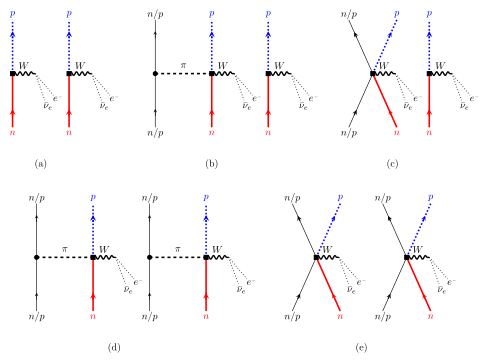

# 快速开始

一个整合的 Codex 自定义 skill：把 **APS 论文写作** 与 **已发表文献调研** 两条流水线合并成一套可重复执行的科研工作流。

## 为什么整合

黑王牛论文写作和文献调研共享同一份"文献数据源"：调研产出结构化文献清单，写作时直接转成 BibTeX 和笔记。整合后一次调研的结果可以反复用于多篇论文，避免重复检索和格式不一致。

## 环境依赖

| 组件 | 位置 / 命令 | 用途 |
| --- | --- | --- |
| TeX Live 2024 | `latexmk`, `pdflatex`, `bibtex` | 编译 APS 论文 |
| Codex 捆绑 Python | `...\codex-primary-runtime\dependencies\python\python.exe` | pdfplumber 解析 PDF |
| Qwen 视觉脚本 | `C:\Users\13425\read_pdf_fig.py` | 读图表与扫描页 |
| APS harvest 接口 | `https://harvest.aps.org/v2/journals/articles/<DOI>/fulltext` | 获取 APS 官方 PDF |

## 示例图（SVG）

下面是 LaTeX TikZ 输出的 PDF 转成 SVG 后的效果，可直接嵌入文档站：

## 公式示例

网站支持 LaTeX 公式。行内公式：$E = mc^2$；独立公式：

$$ M^{(2\nu)} = \sum_{m} \frac{\langle 0_f^+ | \mathcal{O} | m \rangle \; \langle m | \mathcal{O} | 0_i^+ \rangle}{E_m} $$

多行公式（QRPA 声子算符）：

$$
\begin{align}
  \mathcal{Q}_{n}^{\dagger}(JM) &= \sum_{ab} X_{ab}^{nJ} A_{ab}^{\dagger}(JM) - Y_{ab}^{nJ} \tilde{A}_{ab}(JM) \\
  \mathcal{Q}_{n}(JM) &= \sum_{ab} X_{ab}^{nJ\ast} A_{ab}(JM) - Y_{ab}^{nJ\ast} \tilde{A}_{ab}^{\dagger}(JM)
\end{align}
$$

$$
\begin{align}
  \mathcal{Q}_{n}^{\dagger}(JM) &= \sum_{ab} X_{ab}^{nJ} A_{ab}^{\dagger}(JM) - Y_{ab}^{nJ} \tilde{A}_{ab}(JM) \\
  \mathcal{Q}_{n}(JM) &= \sum_{ab} X_{ab}^{nJ\ast} A_{ab}(JM) - Y_{ab}^{nJ\ast} \tilde{A}_{ab}^{\dagger}(JM)
\end{align}
$$

## 使用方法

1. **安装 skill**：把 `skill\aps-research-suite` 文件夹放入 `~/.codex/skills/`。
2. **重启 Codex**：新任务里 skill 自动可用，无需手动 @ 引用。
3. **发起文献调研**：说"调研已发表的 SRPA 论文"。
4. **发起论文写作**：说"开始写 APS 论文，用这份调研清单和这些结果图"。

::: tip 提示
联网抓取（curl / Qwen API）需要你批准沙箱提权；纯本地解析不需要。
:::
